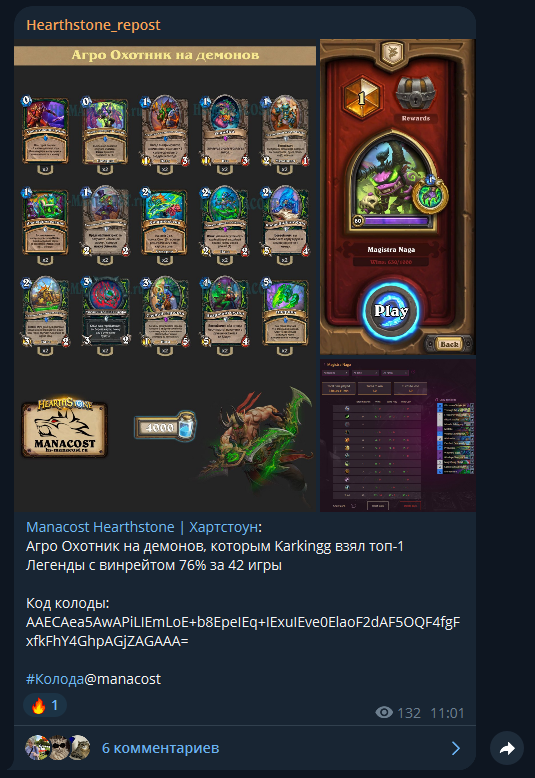
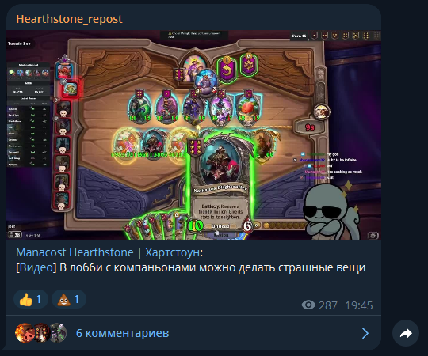

# Репост бот
Телеграм-бот для репостинга постов из ВКонтакте

## Описание
Этот телеграм-бот создан для автоматического репостинга постов из групп ВКонтакте в группы Телеграм. Он поможет вам оставаться в курсе всех обновлений ваших любимых групп ВКонтакте, не покидая при этом Телеграм. Все репосты содержат ссылки на оригинальный пост. Видео репостятся в виде ссылки на видео + превью. 

_Этот бот был написан во время моего первого знакомства с python. Он требует значительной доработки и переработки, в моих планах переписать его на aiogram, когда будет время._  
_Но данный вариант работает, работает стабильно, в комменатриях кода описаны зоны для улучшения без изменения основных библиотек._

## Как это выглядит в телеграм
<details>
<summary>Скриншоты постов</summary>




</details>


## Функции
* Автоматический репостинг постов из групп ВКонтакте в Телеграм
* Возможность выбора групп для репостинга
* Возможность выбора групп Телеграм для публикации
* Исключение из рассылки постов, содержащих определенный текст

## Установка


1. Клонируйте репозиторий:
    ```bash
    git clone https://github.com/vkzam/vkpost.git
    ```
1. Установите необходимые пакеты:
    ```bash
    pip install -r requirements.txt
    ```
1. Получите API токен vk в формате "vk1.a....."  
    <a href="https://dev.vk.com/ru/reference"> Документация API VK</a>  
    * <a href="https://vk.com/editapp?act=create"> Регистрируем</a> Standalone приложение  
    * Формируем ссылку.  
    В ссылке выставляем нужные <a href="https://dev.vk.com/ru/reference/access-rights"> права доступа</a> (атрибут scope)  
    {CLIENT_ID} - ID вашего ВК приложения  
        ```bash    
        https://oauth.vk.com/authorize?client_id={CLIENT_ID}&display=page&redirect_uri=https://oauth.vk.com/blank.html&scope=friends,notify,photos,wall,email,mail,groups,stats,offline&response_type=token&v=5.131
        ```
    * Перейдя по сформированной ссылке, откроется диалоговое окно, в которому будут показаны разрешения, которыми наделяется токен.
    * Подтвердив, произойдёт переадресация на страницу, в адресной строке которой будет access_token. Его-то нам и нужно сохранить.
        ```bash
        https://oauth.vk.com/blank.html#access_token=ACCESS_TOKEN&expires_in=0&user_id=USER_ID
        ```
1. Создаем телеграм бота и получаем его API через <a href="https://t.me/BotFather"> BotFather</a>
1. В config.py:
    * вставляем полученные токены.
    * прописываем Telegram ID админа и Telegram ID группы в которую будем репостить. (Групп и админов можно прописать несколько)
    * Прописываем ID групп ВКонтакте из которых будем репостить.

1. В vkpost.py:
    * Импортируем ID групп ВКонтакте из config.py. Группы, из которых я делаю репосты оставлены в коде для примера.
        ```python
        # группы вк
        from config import (
        MY_GROUP_ID,
        MANACOST_GROUP_ID,
        FANNYHS_GROUP_ID,
        OLESYA_GROUP_ID,
        M3S_GROUP_ID
        )
        ```
    * Переходим в конец кода, туда, где вызовы **save_and_send_posts()**. Мои вызовы я оставил для наглядности, их необходимо убрать и создать свои в виде:
        ```python
        save_and_send_posts(VK_GROUP_ID, 'ИМЯ ФАЙЛА', TG_CHAT_ID)
        ```
        **Имя файла необходимо задать уникальное для каждой отслеживаемой группы. Туда будет сохраняться информация об уже отправленных в телеграм постах**
        **Вк имеет лимит на опрос новостей для API. Для этого в код добавлен slleep(120). При увеличении количества групп таймер необходимо увеличить.**

## Использование
Запустите бота. 
```bash
python vkpost.py
```
Админ с помощью команды "/filter стопслово" может добавить стопслово, по которому пост будет исключен из рассылки.   
Команда "/remove стопслово" удалит стопслово из фильтра.   

Фильтр крайне сырой, команда работает с задержкой, после ввода фильтра бот будет бесконечно присылать список фильтра, пока не написать ему любой другой текст в чате (либо отправить команду /ok).   
Добавлять слова нужно по одному.   
В идеале фильтр необходимо переписать с нуля. 

## Контакты
* <a href="https://t.me/MxCOOL">Телеграм</a>
